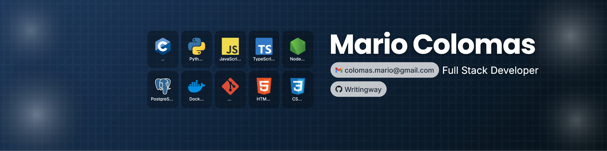

<!-- Banner -->

  

# 👋 About Me
Hi, I’m **Mario Colomas**, Junior Full-Stack Developer in training at **Holberton School Toulouse**.  
I build projects from low-level systems (C, Shell) to full-stack web apps (Python, SQL, JS).  
Currently seeking a **Full-Stack apprenticeship starting September 2026** to contribute to real-world projects and sharpen my skills.

# 🔧 Tech Stack

  

# 📊 GitHub Stats

  

